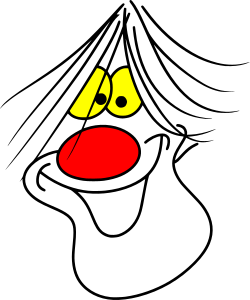

#  Magooify

Turn your quick, roughly-sketched cartoons into clean, scaleable images with smooth lines and consistent colours.

## Features

- **Image Capture**: Take photos from your device (phone or tablet), scan from a desktop visualiser, or simply upload an image.
- **AI Image Processing**: Images are processed to smooth lines, create consistent colours and fill shapes. The prompt used for processing is customisable, and the model used can be selected.
- **Vectorise to SVG**: Optionally trace the processed image into a resolution-independent SVG image.
- **File System Storage**: The processed image is saved to a configurable output directory.
- **Designed For Schools**: Can integrate with your authentication provider (Google, Microsoft, etc) via an authenticating proxy, cloud storage (Google Drive, OneDrive, etc) and filtered / budget-controlled AI API router, making it suitable for educational establishment looking to limit AI tool usage. It can even colour-match the felt-tip pens you use!
- **Self-Hostable**: With a web-based interface and a self-contained, single-executable backend, this application is self-hostable on pretty much any platform, meaning you can control exactly what happens with your user's content.
- **Easy To Customise**: Built in Go with an AI agent, adding or changing features should be a simple case of describing what you want done.

---

## Running

### Desktop

Simply download and run the executable for your platform from the [project homepage](https://sansay.co.uk/magooify/). To process images you need to supply an OpenRouter API key and the folder where processed images should be stored:

```
./magooify -openrouter-key=sk-or-v1-... -output-dir=~/magooify-images
```

Optional flags:

| Flag | Default | Description |
| --- | --- | --- |
| `-openrouter-key` | (unset) | OpenRouter API key used to process captured images. Without it the image endpoint reports that OpenRouter is not configured. |
| `-openrouter-management-key` | (unset) | OpenRouter management key used to query the account balance. Optional; without it the UI shows only the session's spend. Cannot be used to process images. |
| `-output-dir` | `processed` | Folder where processed images are stored. |
| `-model` | `google/gemini-3.1-flash-lite-image` | OpenRouter model used to process the images (any image-capable model). |
| `-prompt-file` | (unset) | Path to a file whose text is sent to the model with each image, instead of the embedded `PROMPT.md`. |
| `-port` | `8080` | Port for the local server. |
| `-mode` | `desktop` | `desktop` or `server`. |
| `-host` | (derived) | Host IP to bind to (`127.0.0.1` in desktop mode, `0.0.0.0` in server mode). |
| `-base-path` | (unset) | Reverse-proxy sub-path prefix, e.g. `/magooify`. |
| `-no-browser` | `false` | Do not auto-launch the browser in desktop mode. |

The environment variables `OPENROUTER_API_KEY`, `OPENROUTER_MANAGEMENT_KEY`, `OUTPUT_DIR`, `OPENROUTER_MODEL`, `PROMPT_FILE`, `PORT`, `APP_MODE`, `HOST` and `BASE_PATH` can be used instead of the equivalent flags.

## Customising the Processing Instructions

The instructions sent to the AI model alongside each image come from the [`PROMPT.md`](PROMPT.md) file at the repository root. The file's text is embedded into the executable at build time, so you can change what the model does with each image simply by editing that file and rebuilding. If `PROMPT.md` is empty or missing the application falls back to a built-in default prompt.

To use a different prompt without rebuilding, point the `-prompt-file` option at your own text file:

```
./magooify -openrouter-key=sk-or-v1-... -prompt-file=~/my-instructions.txt
```

The file's text is read from disk on each use; if it can't be read or is empty, the embedded `PROMPT.md` text (or the built-in default) is used instead.

## Tracking Spend

The UI shows the total cost of the current session (in US dollars, formatted to your locale) in the top bar. When you also supply an OpenRouter *management* key with `-openrouter-management-key` (or the `OPENROUTER_MANAGEMENT_KEY` environment variable), the remaining account balance is shown alongside it. Management keys are administrative-only: they can query your credits but cannot process images, so both keys are needed to see the balance. If the management key is missing or the query fails, the balance is simply hidden and only the session cost is shown.

## Choosing a Model

The **Models** button in the top bar opens a searchable list of the OpenRouter models that can process an image and return a processed image (fetched live from OpenRouter's `/api/v1/images/models` endpoint, which requires your OpenRouter API key, and cached briefly), together with the cost of processing a single image with each one. Click any row to make that model active immediately; the currently configured model is marked *active*. The images listing covers every image model, including image-to-image models such as the Recraft family that the general models endpoint omits. When OpenRouter publishes an exact per-image price for a model it is used; otherwise the cost is estimated from the model's published per-token rates assuming a typical 1024x1024 image plus a generated image output. Prices change, so treat the figures as guidance and check OpenRouter before committing to a model.

## Vectorising Results to SVG

Tick the **Convert result to SVG** box above the Process button and the processed image is traced into a resolution-independent SVG document before being saved, so it can be scaled to any size without pixelation or saved for use in vector drawing tools. The trace is done entirely inside the executable by an embedded vectoriser (in `main.go`) using only the Go standard library: the artwork is split into colour layers matching the bitmap version, each layer's pixels are followed around their boundaries, genuine corners are detected, and each stretch of boundary is fitted with smooth cubic bezier curves. Up to 16 colours are kept as their own layers (each filled with the average colour of its pixels), every other colour is merged into the nearest one, and each layer is emitted as a group with the even-odd fill rule so holes and enclosed shapes trace correctly. Images the model already returns as SVG (some models can be asked directly for vector output) are saved as-is. If the model's output is a format the tracer cannot decode, the request is rejected with a clear error rather than silently saved untraced.

### Server

You can run Magooify behind an authenticating proxy server - the proxy server handles HTTPS, authenticates the user and passes the username to the application via an HTTP header. As the executable is compiled with CGO disabled (CGO_ENABLED=0) and the proxy server is dealing with HTTPS, the container environment can use the `scratch` (completely empty) container image. For instance, if you were using Pangolin as your authenticating server, you would add a basic Dockerfile:

```
# Note: the "scratch" image is 0 bytes, it doesn't have tools like chmod, so there's some extra steps
# needed to get executable files inside a "scratch" image. We need to build a "downloader" image...
FROM alpine:latest AS downloader
RUN apk add --no-cache curl && \
    curl -L https://www.sansay.co.uk/magooify/magooify-linux-amd64 -o /magooify && \
    chmod +x /magooify

# ...then use that to build the actual image we want.
FROM scratch
COPY --from=downloader /magooify /magooify
```
And to docker compose, add something like:
```
magooify:
    image: MAGOOIFY_IMAGE
    command: /magooify -mode=server -port=8080 -base-path=/magooify
    container_name: magooify
    restart: unless-stopped
```
From the Pangolin control panel you would then create a resource, possibly with a prefix ("magooify" or whatever you have named your derived app) using whatever authentication and access controls you like, that pointed at that container (`magooify:8080`). If you do use a prefix for the resource, be sure to add that prefix as the "-base-path" option when running the server.

## Building

Clone the repository:

```
git clone https://github.com/dhicks6345789/magooify.git
```

And run build:

```
cd magooify
bash build.sh build-all
```

This will compile the executables for all platforms.

You can build executables and generate documentation, including Swaggo's interactive API documentation, and copy the lot directly to somewhere they can be served as a web site to act as a project homepage using "build.sh dist". You just need to specify the path you want the files to go to, e.g.:

```
bash build.sh dist ~/www/magooify
```

## Using As a Basis For Your Own Projects

The purpose of this project is to act as a basic starting point for a self-contained "app" that is easy for end users to run and use. It should produce executables able to run on your preferred platform, either as a "desktop app" (a local-only server with a web interface) or as a compact server. Compiling and running the project gives you an image capture and processing application that calls OpenRouter and stores the results on disk, useful to test your build process and that any authentication / endpoint routing is working okay.

Extending this project should be a case of cloning the Git repository and adding your own functions to `api.go` and user interface elements to `ui/index.html`, either by hand or by instructing an AI coding agent. An AGENTS.md is included.

This project was built using OpenCode and its "Big Pickle" model (free, as of August 2026), an instance of GLM-4.6. Documentation (this README) was written by hand.
